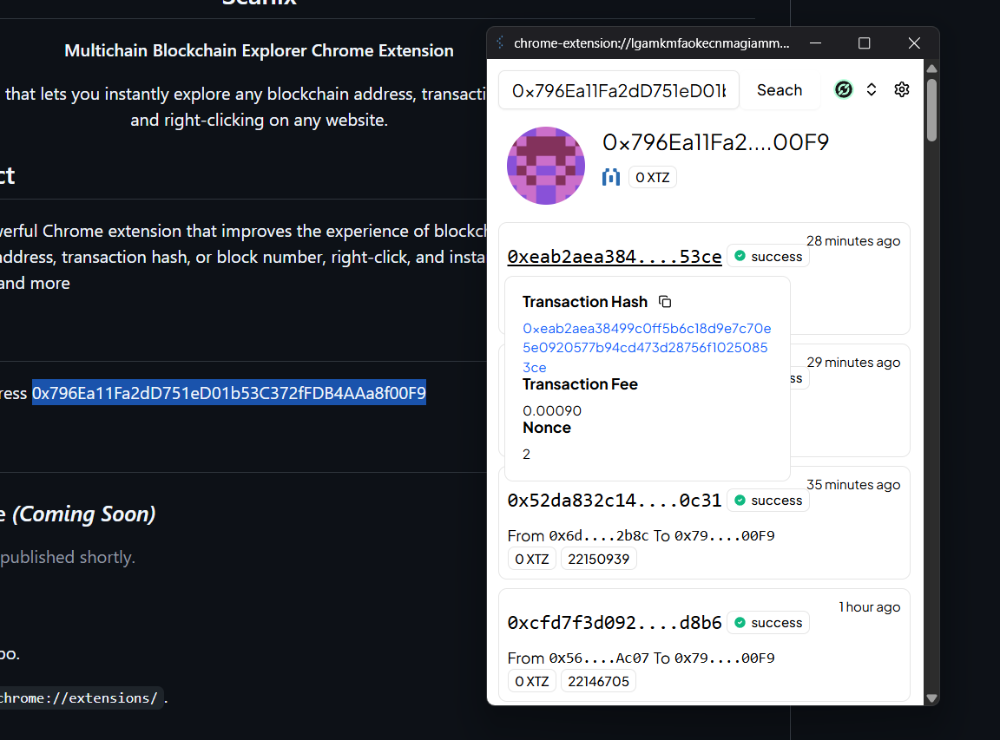

<p align="center">
  <h2 align="center">Scanix</h2>
  <p align="center"><b>Multichain Blockchain Explorer Chrome Extension</b></p>
</p>

## 🔎 About the project

Scanix is a lightweight and powerful Chrome extension that improves the experience of blockchain exploration directly to your browser. Simply highlight any address, transaction hash, or block number, right-click, and instantly get information about it. From Ethereum, Etherlink, Redstone and more

## 🧰 How It Works

First, find any blockchain data on a webpage — this can be an address, transaction hash, or block number. For example, highlight any of the below,

- 0xc9B53AB2679f573e480d01e0f49e2B5CFB7a3EAb
- 0x796Ea11Fa2dD751eD01b53C372fFDB4AAa8f00F9
- 0x24dc388fc939d9bc22c44e79526be919e509d7f2d5268537a4bcedab17e54ba0

Next, highlight the text, right-click, and choose "Search with Scanix" from the context menu.



Scanix will instantly open a popup displaying key details such as the balance, recent transactions, and contract activity — all pulled live from supported blockchains.


## 📦 Installation

### From Chrome Web Store *(Coming Soon)*

> 🚧 In development. Will be published shortly.

### Manual Installation

1. **Clone or download** this repository.

2. **Install and run the project:**

   ```bash
   # Install dependencies
   bun install

   # Start in development mode
   bun run dev
   ```

3. **Load the extension in Chrome:**

   * Open `chrome://extensions/` in your Chrome browser
   * Enable **Developer Mode** (top right corner)
   * Click **Load Unpacked** and select the `dist` folder from the project directory
